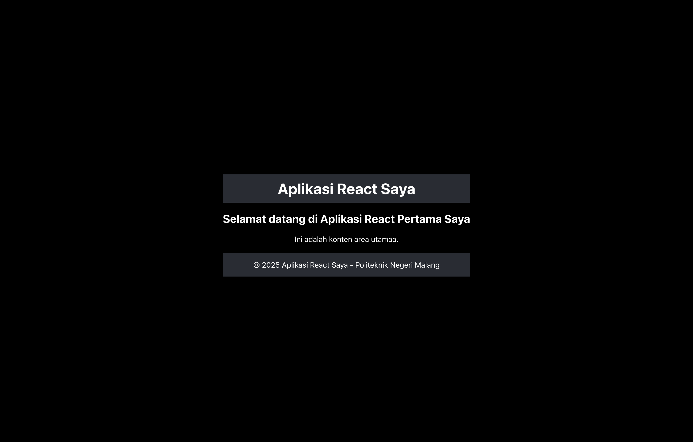
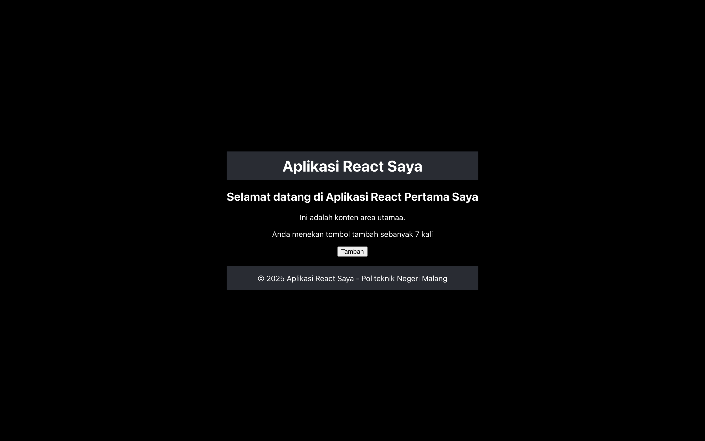
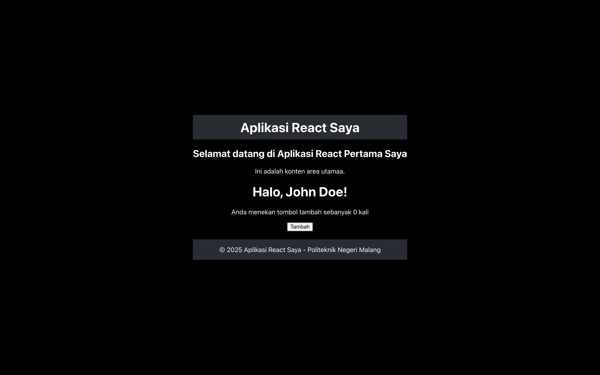
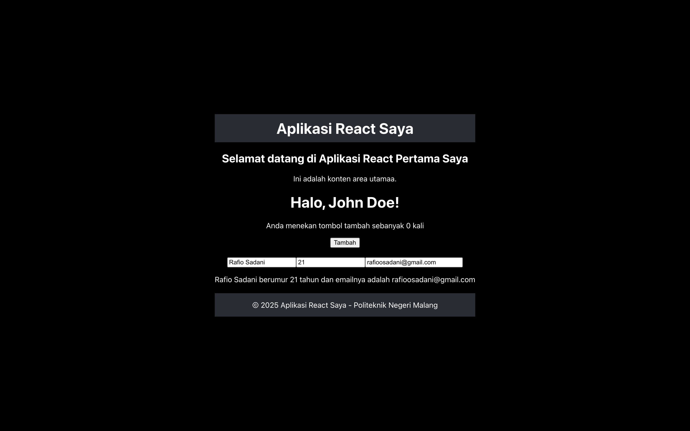

# Laporan Praktikum

|           | Pem. Berbasis Framework 2025 |
| --------- | ---------------------------- |
| **NIM**   | 244107027004                 |
| **Nama**  | Rafio Sadani                 |
| **Kelas** | TI - 4K                      |

## Langkah-langkah Praktikum

1. Membuat dan menambahkan component `Header`, `Main`, dan `Footer` ke dalam file App.js.
   

2. Membuat component `Counter` interaktif yang menggunakan state untuk menyimpan nilai, di mana setiap kali tombol "Tambah" diklik, nilainya akan meningkat / bertambah.
   

3. Membuat component `Greeting` yang menggunakan props untuk meneruskan / mengirim data dari parent ke child component.
   

4. Membuat compenent `Example` untuk menangani pembaruan dan tampilan state `name`, `age`, dan `email` berdasarkan input yang diberikan.
   
