# Laporan Praktikum

|           | Pem. Berbasis Framework 2025 |
| --------- | ---------------------------- |
| **NIM**   | 244107027004                 |
| **Nama**  | Rafio Sadani                 |
| **Kelas** | TI - 4K                      |

## Langkah-Langkah Praktikum

1. Membuat dan menambahkan component `Header`, `Main`, dan `Footer` ke dalam file App.js.
   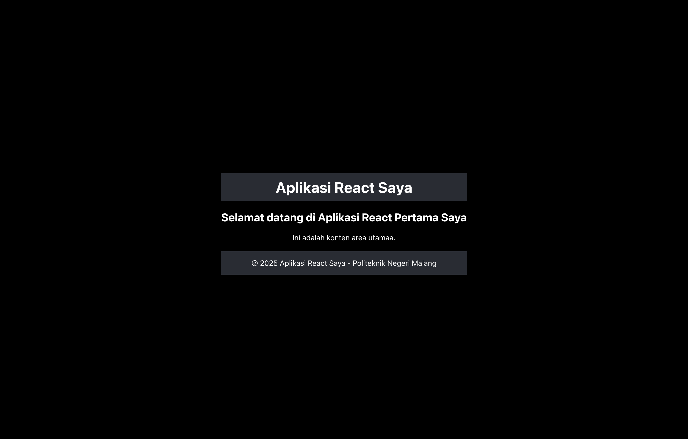

2. Membuat component `Counter` interaktif yang menggunakan state untuk menyimpan nilai, di mana setiap kali tombol "Tambah" diklik, nilainya akan meningkat / bertambah.
   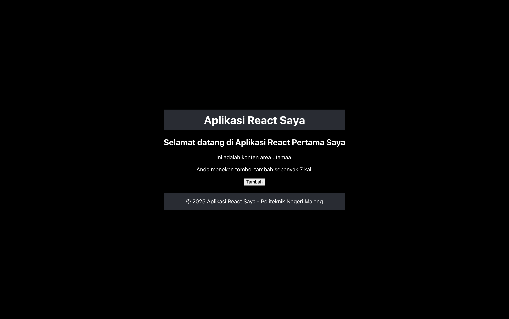

3. Membuat component `Greeting` yang menggunakan props untuk meneruskan / mengirim data dari parent ke child component.
   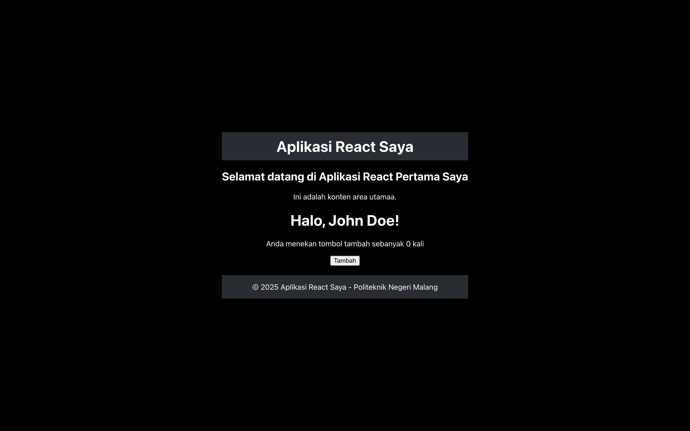

4. Membuat compenent `Example` untuk menangani pembaruan dan tampilan state `name`, `age`, dan `email` berdasarkan input yang diberikan.
   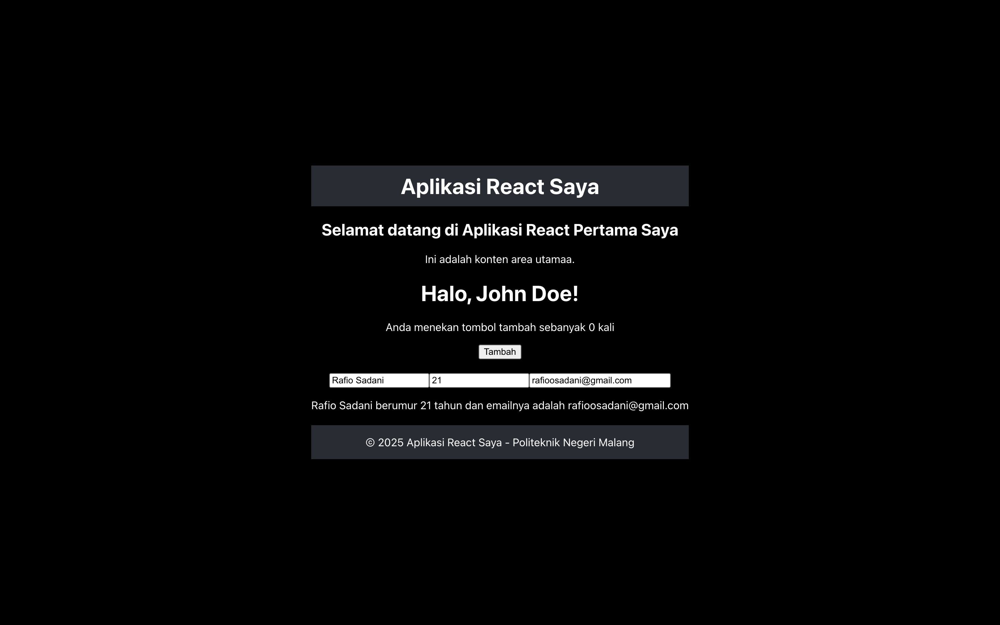

---

## Tugas Praktikum

1. Buat komponen baru bernama TodoList yang menampilkan daftar tugas (todo list). Gunakan state untuk mengelola daftar tugas dan props untuk mengirim data tugas ke komponen anak.
2. Tambahkan fitur untuk menambahkan tugas baru ke dalam daftar menggunakan form input.
3. Implementasikan fitur untuk menghapus tugas dari daftar.

## Jawaban Tugas Praktikum

1. Membuat component `ToDoList` untuk mengelola dan menampilkan daftar tugas, serta component `TaskItem` untuk menampilkan tugas secara terpisah menggunakan Props.
   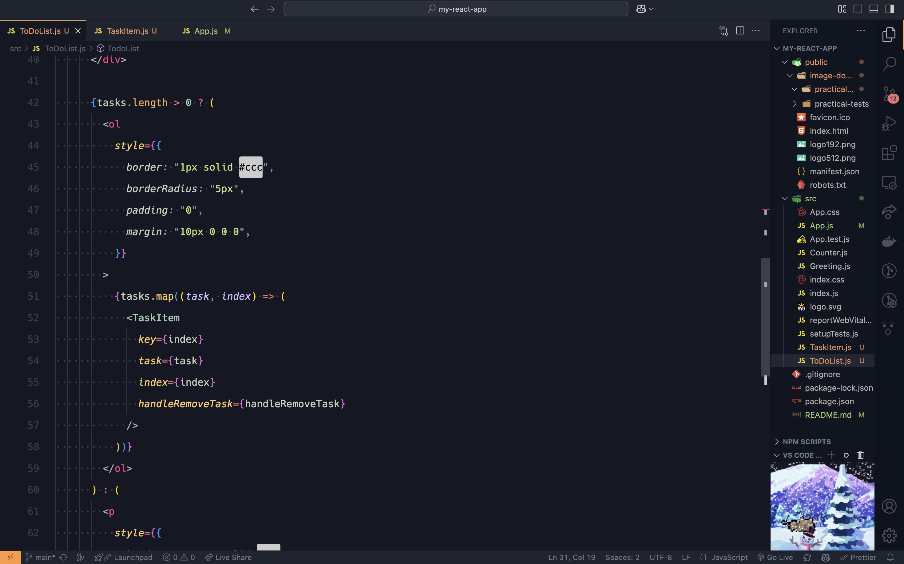
   ***
   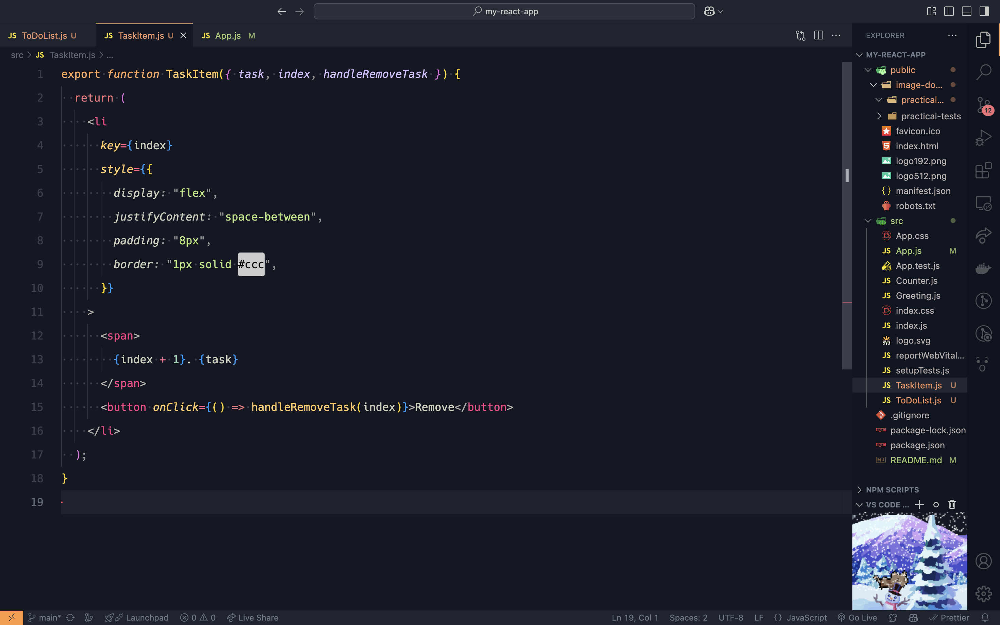
2. Menggunakan state di `TodoList` untuk menyimpan daftar tugas dan menambahkan fitur form input agar pengguna dapat menambahkan tugas baru.
   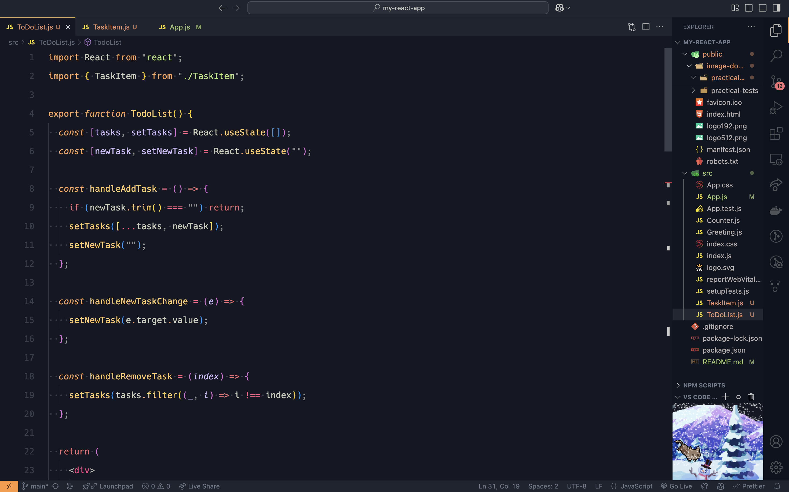

   ***

   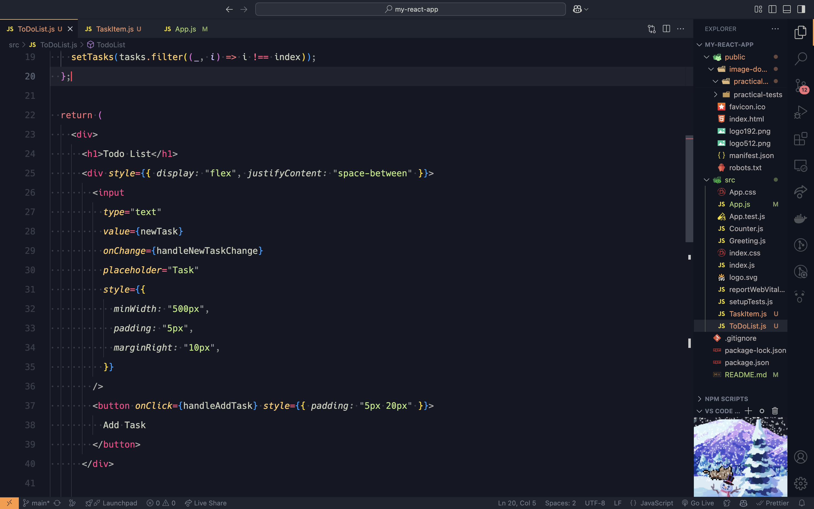

   ***

   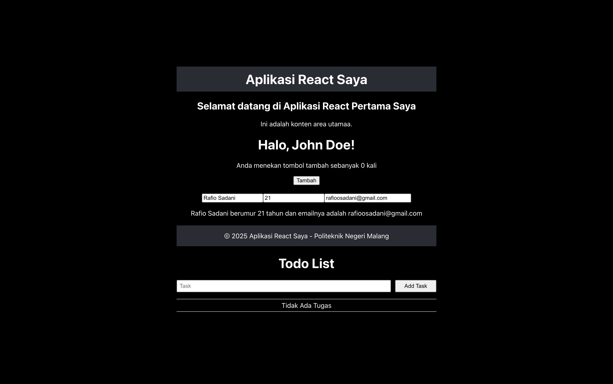

3. Mengimplementasikan fitur yang memungkinkan pengguna menghapus tugas dari daftar, sehingga daftar tugas tetap terorganisir sesuai kebutuhan.
   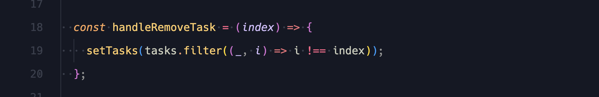

   ***

   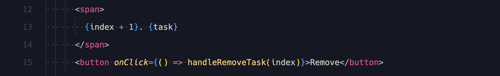

   ***

   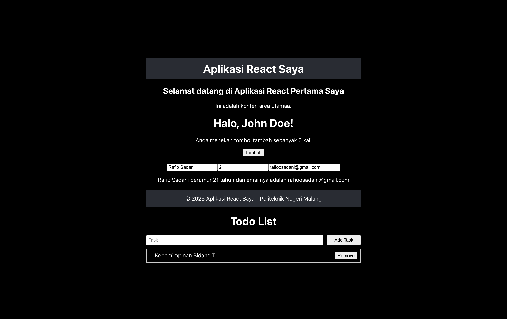

---

## Hasil Akhir Tampilan Implementasi Todo List

Component `TodoList` dan `TaskItem` telah diimplementasikan untuk membuat daftar tugas yang dinamis, menggunakan state untuk mengelola tugas dan props untuk meneruskan data. Fitur penambahan dan penghapusan tugas memungkinkan pengguna mengelola daftar dengan lebih mudah. Hasil implementasi dapat dilihat sebagai berikut.
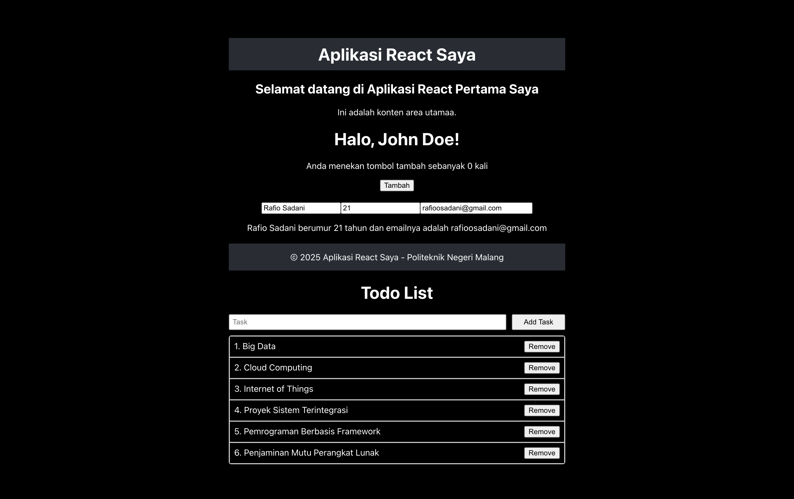
